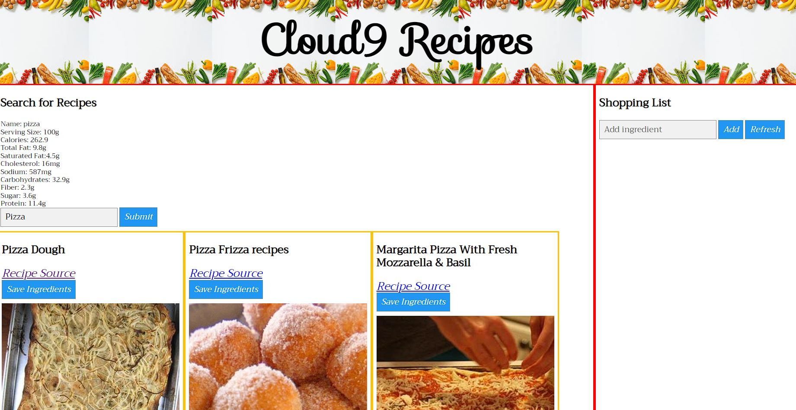

# Cloud9 Recipes

## Description

This page will serve as a site to create a grocery list from recipes

## Table of contents

-[Shopping List Search Bar](#shopping-list)

-[Display of Shopping Ingredients](#shoppingList)

-[Display of Recipies](#savedMeals)

## Installation

This page shows the coding repository: https://github.com/Humbertov374/project-one

## Usage

This page can be viewed live at https://humbertov374.github.io/project-one/

 

## Credits

W3Schools, https://www.w3schools.com/, for Javascript

Rebbeca Burke, Tutor, Helping with GitHub Issues

Raul, Step-in TA, for GitHub Merging Help

                       
